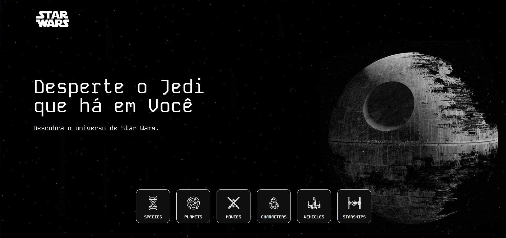

<h1 align="center"> Star Wars Wiki</h1>

<div align="center">

 &nbsp;
 &nbsp;
 &nbsp;
 &nbsp;
 &nbsp;

 &nbsp;
 &nbsp;
 &nbsp;




</div>

## 📌 Resumo do Projeto

O projeto consiste em uma aplicação web interativa que consome dados da API SWAPI (Star Wars API) e os exibe em uma interface visualmente atraente.

## ⭐ Features

- Integração com API SWAPI
- Design Personalizado ([FIGMA](https://www.figma.com/design/3Dbv6g4sMH0MkPFgJNWmDh/Star-Wars-Wiki?node-id=0-1&t=IiopKPE5cDUzj1AM-1))
- Interatividade e Navegação
- Responsibidade

<br>

## 💻 Instalação

Pré Requisitos: - NodeJs (https://nodejs.org/en)

- Clone o repositório deste projeto, e acesse a pasta raíz:

```bash
$ git clone https://github.com/JosivalJr/star-wars.git

$ cd star-wars
```

<br>

- Crie um arquivo .env na pasta raíz, do qual irá armazenar as variáveis de ambiente:

```bash
# Na pasta raíz do projeto
$ echo > ".env"
```

<br>

- Utilize do arquivo `.env.example` para preencher as variáveis corretamente.

<br>

- Para iniciar a aplicação, utilize os seguintes comandos:

```bash
# Para instalar as dependências do projeto
$ npm install

# Para iniciar o projeto no modo de Desenvolvimento
$ npm run dev
```

<br>

## 💻 Demonstração

Para visualizar uma prévia do projeto basta acessar: [https://swiki.netlify.app/](https://swiki.netlify.app/)
